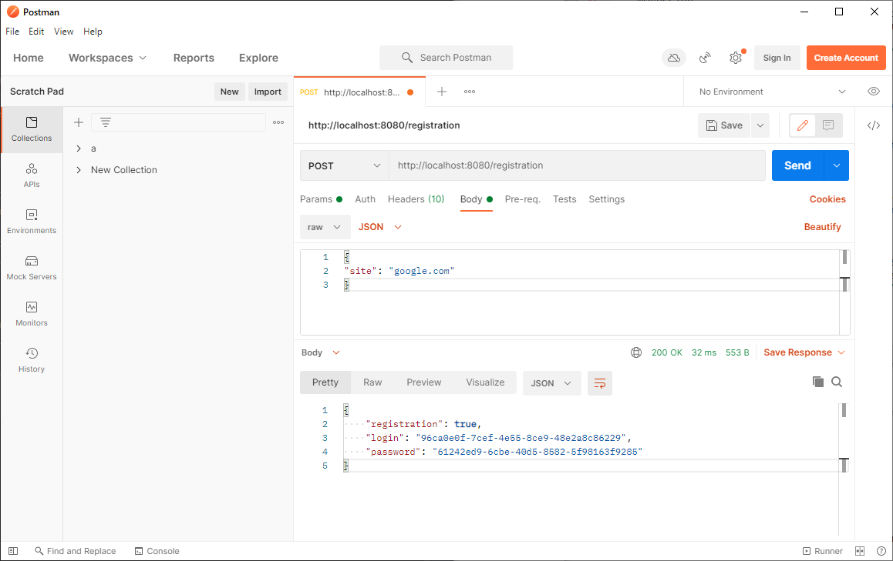
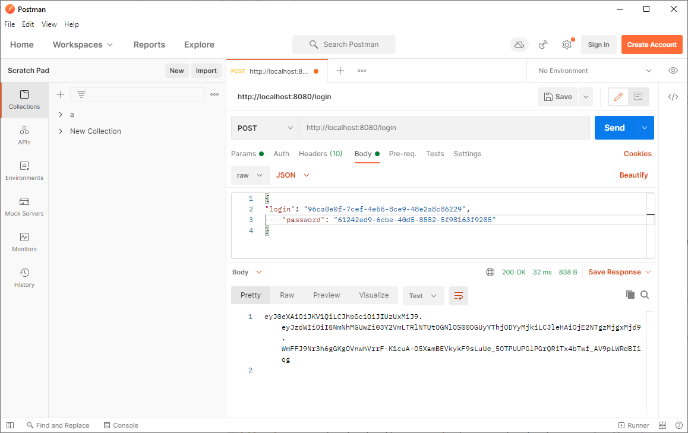
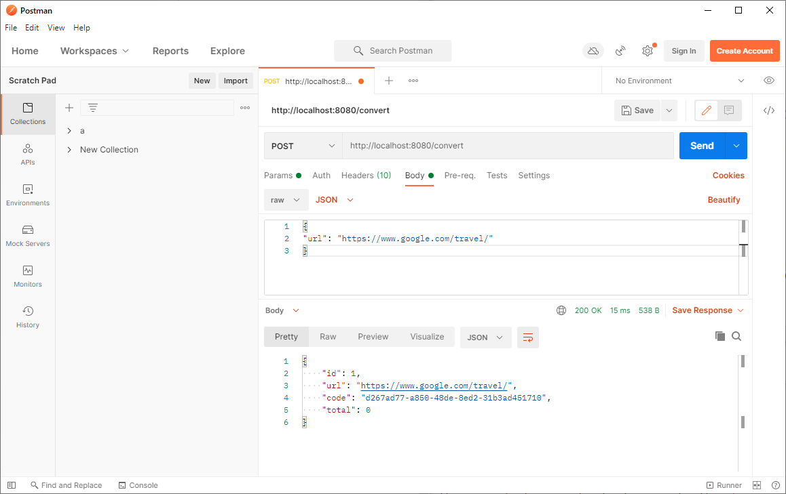
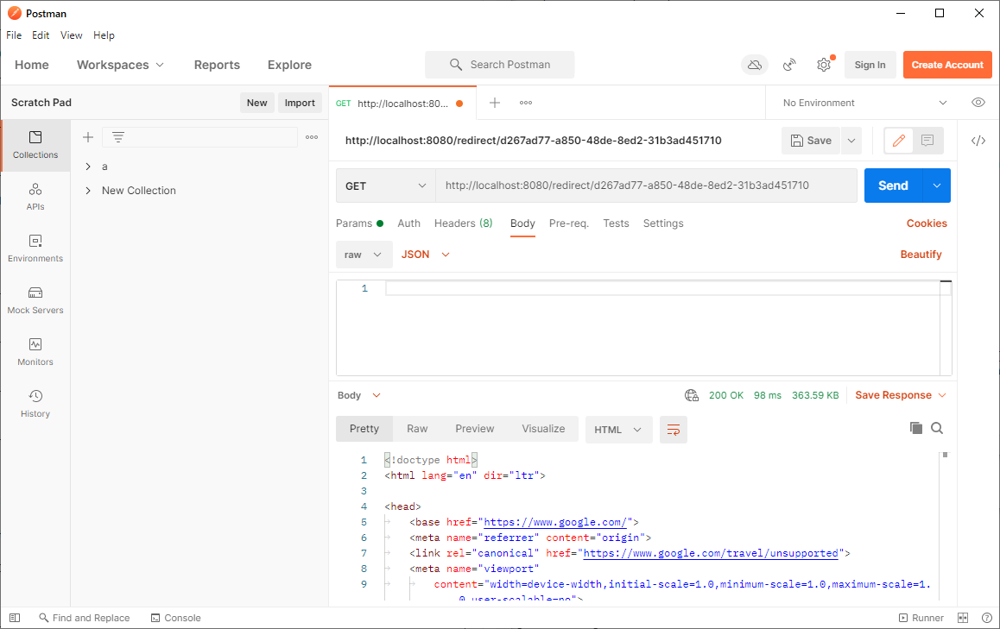
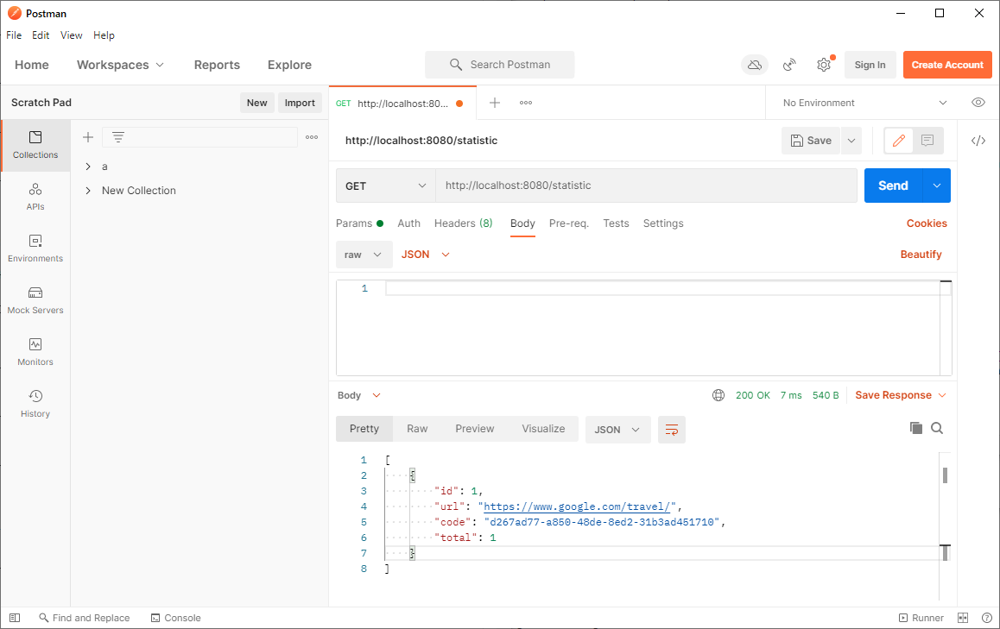

# 
Url Shortcut

### Description:
The service shortens user links and provides convenient and quick access to them.
First, the user registers the site and receives a login and password, then sends links for conversion. 
The number of hits on the converted link is counted and displayed as statistics.

### Used technologies:
* Java 11
* Spring Boot 2
* Spring Security & JWT authorization
* Spring Data JPA
* PostgreSQL

### Using REST API

#### Register site

#### Get token

#### Convert link

#### Redirection. Executed without authorization.

#### Getting statistic

